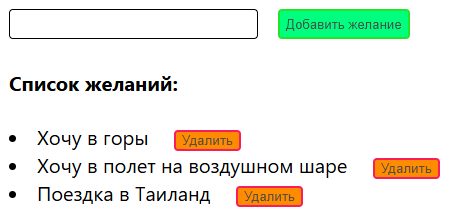

# Vilisov_test
Тестовое задание для фронтенда (React)
Задача: Компонент "Список желаний"

Создай React-приложение с одним компонентом:

Поле ввода для добавления желания (текст).
Кнопка "Добавить", которая добавляет желание в список.
Список желаний с кнопкой "Удалить" рядом с каждым пунктом.
При пустом списке показывай сообщение "Пока желаний нет".

Требования:

Используй хук useState для управления списком.
Добавь inline-стили для компонентов (без CSS-файлов).
В коде оставь 3-5 комментариев, объясняющих, почему ты выбрал такой подход к стилям.
Внизу файла добавь краткое описание (5-7 предложений), как бы ты адаптировал компонент для работы с бэкендом (например, через API).
Код должен запускаться через npm start после create-react-app.
Пример результата:

Вводишь "Поездка в горы" → жмёшь "Добавить" → появляется в списке с кнопкой "Удалить".
Удаляешь все → появляется "Пока желаний нет".

#### Скриншот реализованного приложения:

